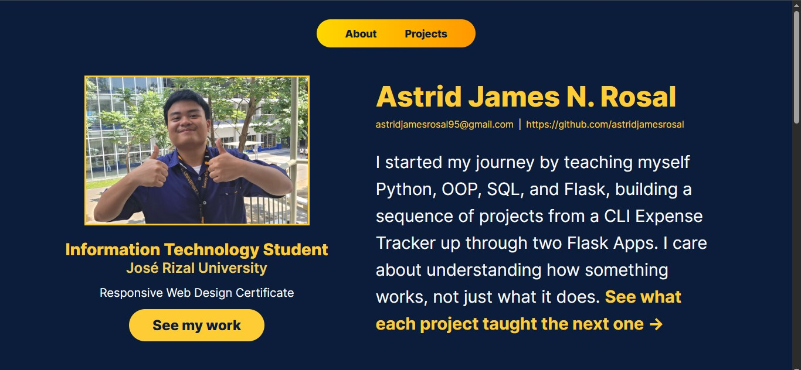
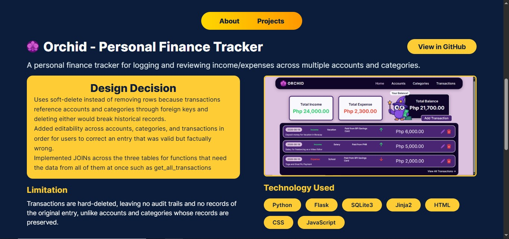

# Portfolio - Astrid Rosal

My personal developer portfolio that documents my path from a self-directed roadmap to two Flask applications, built before starting my BSIT program.

## Tech Stack
- HTML
- CSS

## Sections
- **About** - Contains my background and contact
- **Projects** - Showcases my two Flask Projects, Orchid (Finance Tracker deployed on PythonAnywhere) and Pando (Study Session Tracker)
- **Journey** - Highlights of the technical progression I have executed before College

## How to Run
- Clone this repository
- Open 'portfolioindex.html' in your browser

## Preview

